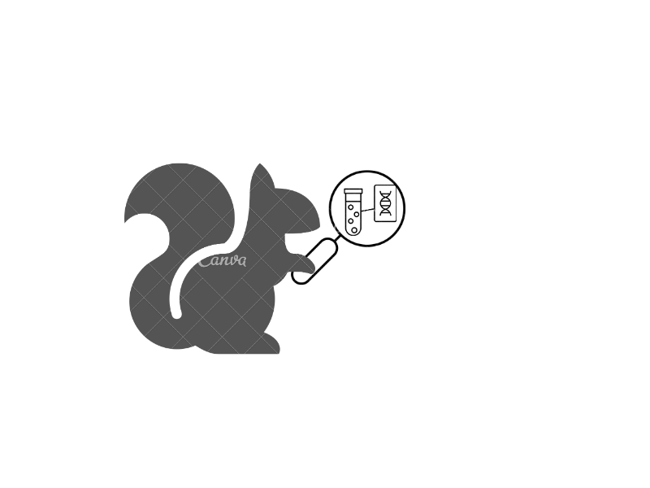

# NoisET<sup>*</sup>  NOIse sampling learning & Expansion detection of T-cell receptors using Bayesian inference.

High-throughput sequencing of T- and B-cell receptors makes it possible to track immune
repertoires across time, in different tissues, in acute and chronic diseases or in healthy individuals. However
quantitative comparison between repertoires is confounded by variability in the read count of each receptor
clonotype due to sampling, library preparation, and expression noise. We present an easy-to-use python
package NoisET that implements and generalizes a previously developed Bayesian method in [Puelma Touzel et al, 2020](<https://journals.plos.org/ploscompbiol/article?id=10.1371/journal.pcbi.1007873&rev=2>). It can be used
to learn experimental noise models for repertoire sequencing from replicates, and to detect responding
clones following a stimulus. The package was tested on different repertoire sequencing technologies and
datasets. NoisET package is desribed in  . 

<sup>* NoisET should be pronounced as "noisettes" (ie hazelnuts in French).</sup>

----------------------------------------------------------------------------------------------------------------------------

# Installation

Python 3 

To install NoisET, gitclone the file in your working environment. 
Using the terminal, go to NoisET directory and write the following command : 

```console
$ sudo python setup.py install
```

# Documentation

## 1/ Infer noise model 

### A/ Command line

To Infer Null noise model: NoisET first function (1), use the command `noiset-noise`
Several options are needed to learn noise model from two replicate samples associated to one individual at a specific time point:

#### 1/ Data information:

- `--path 'PATHTODATA'`: set path to data file 
- `--f1 'FILENAME1_X_REP1'`: filename for individual X replicate 1 
- `--f2 'FILENAME2_X_REP2'`: filename for individual X replicate 2 

If your TCR CDR3 clonal populations features (ie clonal fractions, clonal counts, clonal nucleotide CDR3 sequences and clonal amino acid sequences) have different column names than: ('Clone fraction', 'Clone count', 'N. Seq. CDR3', 'AA. Seq. CDR3), you can specify the name directly by using: 

- `--specify` 
- `--freq 'frequency'` : Column label associated to clonal fraction 
- `--counts 'counts'`:  Column label associated to clonal count  
- `--ntCDR3 'ntCDR3'`:  Column label associated to clonal CDR3 nucleotides sequence  
- `--AACDR3 'AACDR3'`:  Column label associated to clonal CDR3 amino acid sequence


#### 2/ Choice of noise model: (parameters meaning described in Methods section)
- `--NBPoisson`: Negative Binomial + Poisson Noise Model - 5 parameters 
- `--NB`: Negative Binomial - 4 parameters  
- `--Poisson`: Poisson - 2 parameters 

#### 3/ Example:
At the command prompt, type:
```console
$ noiset-noise --path 'data_examples/' --f1 'Q1_0_F1_.txt.gz' --f2 'Q1_0_F2_.txt.gz' --NB
```
This command line will learn four parameters associated to negative binomial null noise Model `--NB` for individual Q1 at day 0.
A '.txt' file is created in the working directory: it is a 5/4/2 parameters data-set regarding on NBP/NB/Poisson noise model. In this example, it is a four parameters table (already created in data_examples repository). 
You can run previous examples using data (Q1 day 0/ day15) provided in the data_examples folder - data from [Precise tracking of vaccine-responding T cell clones reveals convergent and personalized response in identical twins, Pogorelyy et al, PNAS](https://www.pnas.org/content/115/50/12704) 

### 4/ Example with `--specify`:

At the command prompt, type:
```console
$ noiset-noise --path 'data_examples/' --f1 'replicate_1_1.tsv.gz' --f2 'replicate_1_2.tsv.gz' --specify --freq 'frequencyCount' --counts 'count' --ntCDR3 'nucleotide' --AACDR3 'aminoAcid' --NB
```
As previously this command enables us to learn four parameters associated to negative binomial null noise model `--NB` for one individual in cohort produced in [Model to improve specificity for identification of clinically-relevant expanded T cells in peripheral blood, Rytlewski et al, PLOS ONE](https://journals.plos.org/plosone/article?id=10.1371/journal.pone.0213684). 

### B/ Python package 

For Python users, it is possible to use NoisET as a package importing it as mentioned before. A jupyter notebook explaining the use of all the functions of interest is provided: NoisET example - Null model learning.ipynb
```python 
import noisets
from noisets import noisettes as ns
```
You can download the Jupyter notebook and modify it with your own PATHTODATA / datafile specificities.

## 2/ Generate synthetic data for null model learning:

To qualitatively check consistency of the NoisET first function (1) with experiments or for other reasons, it can be useful to generates synthetic replicates from the null model (described in Methods section).

### A/ Command line

#### 1/ Choice of noise model:
- `--NBPoisson`: Negative Binomial + Poisson Noise Model - 5 parameters 
- `--NB`: Negative Binomial - 4 parameters  
- `--Poisson`: Poisson - 2 parameters 

#### 2/ Specify learnt parameters:
- `--nullpara 'PATHTOFOLDER/NULLPARAS.txt'`: parameters learnt thanks to NoisET function (1) \
!!! Make sure to match correctly the noise model and the null parameter file content : 5 parameters for `--NBP`, 4 parameters for `--NB`and 2 parameters
for `--Poisson`. 

#### 3/ Sequencing properties of data:
- `--NreadsI NNNN`: total number  of reads in first replicate - it should match the actual data. In the example below, it is the sum of 'Clone count' in 'Q1_0_F1_.txt.gz'. 
- `--Nreads2 NNNN`: total number  of reads in second replicate - it should match the actual data. In the example below, it is the sum of 'Clone count' in 'Q1_0_F2_.txt.gz'. 
- `--Nclones NNNN`: total number of clones in union of two replicates - it should match the actual data. In the example below, it is the number of clones present in both replicates : 'Q1_0_F1_.txt.gz' and 'Q1_0_F2_.txt.gz'.

### 4/ Output file
`--output 'SYNTHETICDATA'`: name of the output file where you can find the synthetic data set. 

At the command prompt, type 
 ```console
 $ noiset-nullgenerator --NB --nullpara 'data_examples/nullpara1.txt' --NreadsI 829578 --NreadsII 954389 --Nclones 776247 --output 'test'  
 ```
 ### B/ Python package 

For Python users, it is possible to use NoisET as a package importing it as mentioned before. A jupyter notebook explaining the use of all the functions of interest is provided: <strong> NoisET example - Null model learning.ipynb </strong>
```python 
import noisets
from noisets import noisettes as ns
```
You can download the Jupyter notebook and modify it with your own PATHTODATA / datafile specificities - visualization tools are also provided.


 ## 3/ Detect responding clones:
 
Detects responding clones to a stimulus: NoisET second function (2)

### A/ Command line

#### 1/ Choice of noise model:
- `--NBPoisson`: Negative Binomial + Poisson Noise Model - 5 parameters 
- `--NB`: Negative Binomial - 4 parameters  
- `--Poisson`: Poisson - 2 parameters 

#### 2/ Specify learnt parameters for both time points:
(they can be the same for both time points if replicates are not available but to use carefully as mentioned in [ARTICLE]) 
- `--nullpara1 'PATH/FOLDER/NULLPARAS1.txt'`: parameters learnt thanks to NoisET function (1) for time 1 
- `--nullpara2 'PATH/FOLDER/NULLPARAS2.txt'`: parameters learnt thanks to NoisET function (1) for time 2  

!!! Make sure to match correctly the noise model and the null parameters file content : 5 parameters for `--NBP`, 4 parameters for `--NB`and 2 parameters
for `--Poisson`. 

#### 3/ Data information:

- `--path 'PATHTODATA'`: set path to data file 
- `--f1 'FILENAME1_X_time1'`: filename for individual X time 1 
- `--f2 'FILENAME2_X_time2'`: filename for individual X time 2 

If your TCR CDR3 clonal populations features (ie clonal fractions, clonal counts, clonal nucleotides CDR3 sequences and clonal amino acids sequences) have different column names than: ('Clone fraction', 'Clone count', 'N. Seq. CDR3', 'AA. Seq. CDR3), you can specify the name by using: 

- `--specify` 
- `--freq 'frequency'` : Column label associated to clonal fraction 
- `--counts 'counts'`:  Column label associated to clonal count  
- `--ntCDR3 'ntCDR3'`:  Column label associated to clonal CDR3 nucleotides sequence  
- `--AACDR3 'AACDR3'`:  Column label associated to clonal CDR3 amino acid sequence

#### 4/ Detection thresholds: (More details in Methods section).
- `--pval XXX` : p-value threshold for the expansion/contraction - use 0.05 as a default value. 
- `--smedthresh XXX` : log fold change median threshold for the expansion/contraction - use 0 as a default value. 

### 5/ Output file
`--output 'DETECTIONDATA'`: name of the output file (.csv) where you can find a list of the putative responding clones with statistics features. (More details in Methods section).


At the command prompt, type 
```console
$ noiset-detection --NB  --nullpara1 'data_examples/nullpara1.txt' --nullpara2 'data_examples/nullpara1.txt' --path 'data_examples/' --f1 'Q1_0_F1_.txt.gz' --f2 'Q1_15_F1_.txt.gz' --pval 0.05 --smedthresh 0 --output 'detection' 
```

Ouput: table containing all putative detected clones with statistics features about logfold-change variable <em> s </em>: more theoretical description [Puelma Touzel et al, 2020](<https://journals.plos.org/ploscompbiol/article?id=10.1371/journal.pcbi.1007873&rev=2>).

 ### B/ Python package 

For Python users, it is possible to use NoisET as a package importing it as mentioned before. A jupyter notebook explaining the use of all the functions of interest is provided: <strong> NoisET example - detection responding clones.ipynb </strong>
```python 
import noisets
from noisets import noisettes as ns
```
You can download a Jupyter notebook and modify it with your own PATHTODATA / datafile specificities - visualization tools are also provided.

# Methods

## Noise Learning (1)
The user must chose one of the three possible models for the probability that a TCR has <strong> an empirical count n </strong> knowing that its  <strong> true frequency is f </strong>, P(n|f): a Poisson distribution `--Poisson`, a negative binomial distribution `--NB`, or a two-step model combining Negative-Binomial and a Poisson distribution `--NBP`. n is the empirical clone size and  depends on the experimental protocol.
For each P(n|f), a set of parameters is learnt. 

- For `--NBP`: 5 parameters described in [Puelma Touzel et al, 2020](<https://journals.plos.org/ploscompbiol/article?id=10.1371/journal.pcbi.1007873&rev=2>): power-law exponent of clonotypes frequencies distributions `'alph_rho'`, minimum of clonotype frequencies distribution `'fmin'`, `'beta'` and `'alpha'`, parameters of negative binomial distribution constraining mean and variance of P(m|f) distribution (m being the number of cells associated to a clonotype in the experiemental sample), and `'m_total'` the total number of cells in the sample of interest..
- for `--NB`: 4 parameters: power-law of the clonotypes frequencies distributions (same ansatz than in [Puelma Touzel et al, 2020](<https://journals.plos.org/ploscompbiol/article?id=10.1371/journal.pcbi.1007873&rev=2>) `'alph_rho'`, minimum of clonotype frequencies distribution `'fmin'`, `'beta'` and `'alpha'`, parameters of negative binomial distribution constraining mean and variance of P(n|f) distribution. <em> NB(fNreads, fNreads + betafNreads<sup>alpha</sup>) </em>. (Nreads is the total number of reads in the sample of interest.)
- for `--Poisson`: power-law of the clonotypes frequencies distributions (same ansatz than in [Puelma Touzel et al, 2020](<https://journals.plos.org/ploscompbiol/article?id=10.1371/journal.pcbi.1007873&rev=2>)`'alph_rho'` and minimum of clonotype frequencies distribution `'fmin'`.
P(n|f) is Poisson distribution of parameter <em> fNreads </em>. (Nreads is the total number of reads in the sample of interest.)

## Detection learning (2)

The posterior log-fold change distribution computed after optimizing equation [10](<https://journals.plos.org/ploscompbiol/article?id=10.1371/journal.pcbi.1007873&rev=2>) is used to compute the dynamics of each particular clones population (or frequency). Here we give meaning of the different features displayed in ouput file 'detection 

[Identifying clones](<https://journals.plos.org/ploscompbiol/article?id=10.1371/journal.pcbi.1007873&rev=2>) paragraph of [Puelma Touzel et al, 2020].


# Contact

Any issues or questions should be addressed to [us](mailto:meriem.bensoudakoraichi@gmail.com).

# LICENSE
Free use of NoisET is granted under the terms of the GNU General Public License version 3 (GPLv3).

