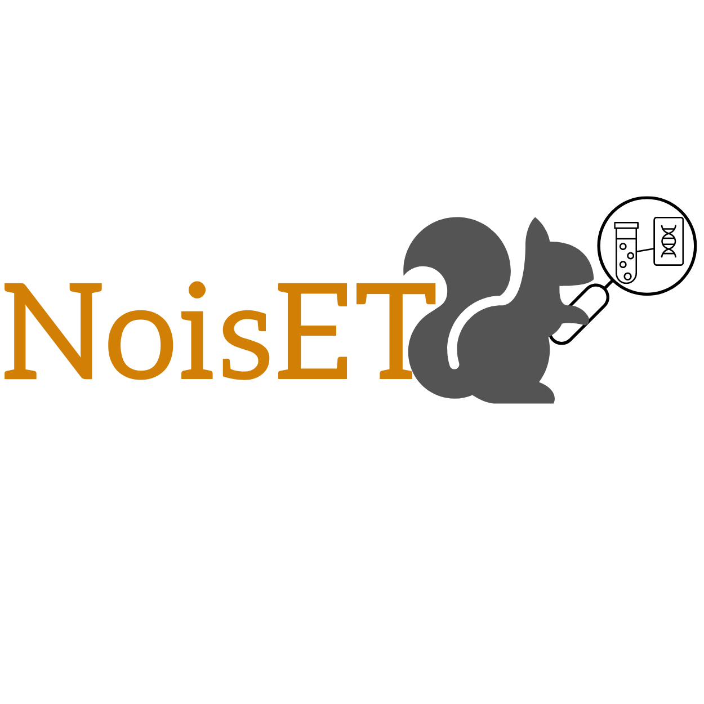
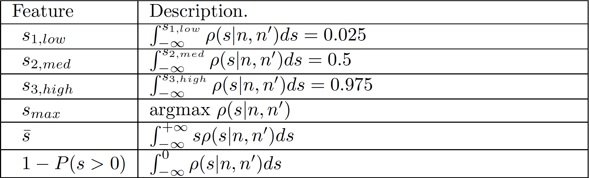

<p align= "center"> </p>

# NoisET<sup>*</sup>  NOIse sampling learning & Expansion detection of T-cell receptors using Bayesian inference.

High-throughput sequencing of T- and B-cell receptors makes it possible to track immune
repertoires across time, in different tissues, in acute and chronic diseases or in healthy individuals. However
quantitative comparison between repertoires is confounded by variability in the read count of each receptor
clonotype due to sampling, library preparation, and expression noise. We present an easy-to-use python
package NoisET that implements and generalizes a previously developed Bayesian method in [Puelma Touzel et al, 2020](<https://journals.plos.org/ploscompbiol/article?id=10.1371/journal.pcbi.1007873&rev=2>). It can be used
to learn experimental noise models for repertoire sequencing from replicates, and to detect responding
clones following a stimulus. The package was tested on different repertoire sequencing technologies and
datasets. NoisET package is desribed [here](<https://arxiv.org/abs/2102.03568>). 

<sup>* NoisET should be pronounced as "noisettes" (ie hazelnuts in French).</sup>

----------------------------------------------------------------------------------------------------------------------------

# Installation

Python 3 

NoisET is a python /3.6 software. It is available on PyPI and can be downloaded and installed through pip:

```console
$ pip install noisets
```
Watch out, Data pre-processing, diversity estimates and generation of neutral TCR clonal dynamics is not possible yet with installation with pip. Use only the sudo command below.

To install NoisET and try the tutorial dusplayed in this github: gitclone the file in your working environment. 
Using the terminal, go to NoisET directory and write the following command : 

```console
$ sudo python setup.py install
```

# Documentation

A tutorial is available at https://github.com/mbensouda/NoisET_tutorial . 
Three commands are available to use :
- `noiset-noise` To infer Null noise model: NoisET first function (1)
- `noiset-nullgenerator` To qualitatively check consistency of NoisET first function
- `noiset-detection` To detect responding clones to a stimulus: NoisET second function (2)

All options are described typing one of the previous commands + `--help`or `-h`. Options are also described in the following READme.
Notebooks are also available.

## 1/ Data pre-processing

The python package enables to manipulate longitudinal RepSeq data and find the relevant time points to compare to study TCR repertoire dynamics after an acute stimulus. In the notebook given as an example, we give the analysis published in https://elifesciences.org/articles/63502 (PCA analysis of clonal abundance trajectories) and additional tools to manipulate longitudinal RepSeq data. 
Go check : [here](<https://github.com/statbiophys/NoisET/blob/master/NoisET%20example%20-%20data%20-%20preprocessing.ipynb>).

```python 
data_pre = ns.longitudinal_analysis(patient, data_folder)
```

This object has the following methods:

```python
.import_clones()
```
to import all the clonotypes of a given patient and store them in a dictionary. It returns also the list of #ordered time points of the longitudinal dataset.

    Parameters
    ----------
    patient : str
        The ID of the patient
    data_folder : str
        The name of the folder to find data

    Returns
    -------
    dictionary
        a dictionary of data_frames giving all the samples of the patient.
       
    numpy vector
        a vector containing all the RepSeq sampling times ordered.

```python
.get_top_clones_set()
```
to get the n_top_clones TCR nucleotides sequence of patient of interest at every time point.

    Parameters
    ----------
    n_top_clones : int
        the n_top_clones TCR abundance you want to extract from each RepSeq sample
   
    Returns
    -------
    list of str
        list of TCR nucleotide sequencesof each RepSeq sample

```python
.build_traj_frame() 
```
build a dataframe with abundance trajectories of the n_top_clones TCR of patient of interest at every time point

    Parameters
    ----------
    top_clones : list 
        list of TCR nucleotide sequences you want to build the trajectories dataframe, it is the output of .get_top_clones_set()
   
    Returns
    -------
    data-frame
        abundance trajectories of the n_top_clones TCR of patient of interest at every time point

```python 
.PCA_traj()
```
to get pca and clustering objects as in the [scikit-learn-PCA](<https://scikit-#learn.org/stable/modules/generated/sklearn.decomposition.PCA.html>) and [scikit-learn-clustering](<https://scikit-#learn.org/stable/modules/clustering.html>). 

    Parameters
    ----------
    n_top_clones : int
        the n_top_clones TCR abundance you want to extract from each RepSeq sample
   
    Returns
    -------
    scikit learn objects

Other methods to manipulate and visualize longitudinal RepSeq abundance data are provided.


## 2/ Infer noise model 

### A/ Command line

To Infer Null noise model: NoisET first function (1), use the command `noiset-noise`
Several options are needed to learn noise model from two replicate samples associated to one individual at a specific time point:

#### 1/ Data information:

- `--path 'PATHTODATA'`: set path to data file 
- `--f1 'FILENAME1_X_REP1'`: filename for individual X replicate 1 
- `--f2 'FILENAME2_X_REP2'`: filename for individual X replicate 2 

If your TCR CDR3 clonal populations features (ie clonal fractions, clonal counts, clonal nucleotide CDR3 sequences and clonal amino acid sequences) have different column names than: ('Clone fraction', 'Clone count', 'N. Seq. CDR3', 'AA. Seq. CDR3), you can specify the name directly by using: 

- `--specify` 
- `--freq 'frequency'` : Column label associated to clonal fraction 
- `--counts 'counts'`:  Column label associated to clonal count  
- `--ntCDR3 'ntCDR3'`:  Column label associated to clonal CDR3 nucleotides sequence  
- `--AACDR3 'AACDR3'`:  Column label associated to clonal CDR3 amino acid sequence


#### 2/ Choice of noise model: (parameters meaning described in Methods section)
- `--NBPoisson`: Negative Binomial + Poisson Noise Model - 5 parameters 
- `--NB`: Negative Binomial - 4 parameters  
- `--Poisson`: Poisson - 2 parameters 

#### 3/ Example:
At the command prompt, type:
```console
$ noiset-noise --path 'data_examples/' --f1 'Q1_0_F1_.txt.gz' --f2 'Q1_0_F2_.txt.gz' --NB
```
This command line will learn four parameters associated to negative binomial null noise Model `--NB` for individual Q1 at day 0.
A '.txt' file is created in the working directory: it is a 5/4/2 parameters data-set regarding on NBP/NB/Poisson noise model. In this example, it is a four parameters table (already created in data_examples repository). 
You can run previous examples using data (Q1 day 0/ day15) provided in the data_examples folder - data from [Precise tracking of vaccine-responding T cell clones reveals convergent and personalized response in identical twins, Pogorelyy et al, PNAS](https://www.pnas.org/content/115/50/12704) 

#### 4/ Example with `--specify`:

At the command prompt, type:
```console
$ noiset-noise --path 'data_examples/' --f1 'replicate_1_1.tsv.gz' --f2 'replicate_1_2.tsv.gz' --specify --freq 'frequencyCount' --counts 'count' --ntCDR3 'nucleotide' --AACDR3 'aminoAcid' --NB
```
As previously this command enables us to learn four parameters associated to negative binomial null noise model `--NB` for one individual in cohort produced in [Model to improve specificity for identification of clinically-relevant expanded T cells in peripheral blood, Rytlewski et al, PLOS ONE](https://journals.plos.org/plosone/article?id=10.1371/journal.pone.0213684). 

### B/ Python package 

For Python users, it is possible to use NoisET as a package importing it as mentioned before. A jupyter notebook explaining the use of all the functions of interest is provided: NoisET example - Null model learning.ipynb
```python 
import noisets
from noisets import noisettes as ns
```
You can download the Jupyter notebook and modify it with your own PATHTODATA / datafile specificities.

## 3/ Generate synthetic data from null model learning:

A diversity estimator can be used from the knowledge of the noise model which has been learnt in a first step: Go check : [here](<https://github.com/statbiophys/NoisET/blob/master/NoisET%20example%20-%20Null%20model%20learning%20.ipynb>)

```python 
null_model = ns.Noise_Model()
null_model.diversity_estimate()
```
Compute the diversity estimate from data and the infered noise model.
    
    
    Parameters
    ----------
    df : data-frame 
        The data-frame which has been used to learn the noise model
    paras : numpy array
        vector containing the noise parameters
    noise_model : int
        choice of noise model 

    Returns
    -------
    float
        diversity estimate from the noise model inference.


## 4/ Generate synthetic data from null model learning:

To qualitatively check consistency of NoisET first function (1) with experiments or for other reasons, it can be useful to generates synthetic replicates from the null model (described in Methods section).
One can also generalte healthy RepSeq samples dynamics using the noise model which has been learnt in a first step anf giving the time-scale dynamics of turnover of the repertoire as defined in https://www.biorxiv.org/content/10.1101/2022.05.01.490247v1. Check [here](<https://github.com/statbiophys/NoisET/blob/master/NoisET%20example%20-%20Null%20model%20learning%20.ipynb>).  

### A/ Command line

#### 1/ Choice of noise model:
- `--NBPoisson`: Negative Binomial + Poisson Noise Model - 5 parameters 
- `--NB`: Negative Binomial - 4 parameters  
- `--Poisson`: Poisson - 2 parameters 

#### 2/ Specify learnt parameters:
- `--nullpara 'PATHTOFOLDER/NULLPARAS.txt'`: parameters learnt thanks to NoisET function (1) \
!!! Make sure to match correctly the noise model and the null parameter file content : 5 parameters for `--NBP`, 4 parameters for `--NB`and 2 parameters
for `--Poisson`. 

#### 3/ Sequencing properties of data:
- `--NreadsI NNNN`: total number  of reads in first replicate - it should match the actual data. In the example below, it is the sum of 'Clone count' in 'Q1_0_F1_.txt.gz'. 
- `--Nreads2 NNNN`: total number  of reads in second replicate - it should match the actual data. In the example below, it is the sum of 'Clone count' in 'Q1_0_F2_.txt.gz'. 
- `--Nclones NNNN`: total number of clones in union of two replicates - it should match the actual data. In the example below, it is the number of clones present in both replicates : 'Q1_0_F1_.txt.gz' and 'Q1_0_F2_.txt.gz'.

#### 4/ Output file
`--output 'SYNTHETICDATA'`: name of the output file where you can find the synthetic data set. 

At the command prompt, type 
 ```console
 $ noiset-nullgenerator --NB --nullpara 'data_examples/nullpara1.txt' --NreadsI 829578 --NreadsII 954389 --Nclones 776247 --output 'test'  
 ```
 Running this line, you create a 'synthetic_test.csv' file with four columns : 'Clone_count_1', 'Clone_count_2', 'Clone_fraction_1', 'Clone_fraction_2', resctively synthetic read counts and frequencies that you would have found in an experimental sample of same learnt parameters 'nullpara1.txt', 'NreadsI', 'NreadsII' and 'Nclones'.
 
 ### B/ Python package 

For Python users, it is possible to use NoisET as a package importing it as mentioned before. A jupyter notebook explaining the use of all the functions of interest is provided: <strong> NoisET example - Null model learning.ipynb </strong>
```python 
import noisets
from noisets import noisettes as ns
```
You can download the Jupyter notebook and modify it with your own PATHTODATA / datafile specificities - visualization tools are also provided.
 

```python 
cl_neutral_dyn = ns.Generator()
```
To generate synthetic neutral dynamics of TCR RepSeq data.

    Parameters
    ----------
    paras_1  : numpy array
        parameters of the noise model that has been learnt at time_1
    paras_2  : numpy array
        parameters of the noise model that has been learnt at time_2
    method   : str
    'negative_binomial' or 'poisson'
    tau      : float
    first time-scale parameter of the dynamics
    theta    : float
    second time-scale parameter of the dynamics
    t_ime    : float
    number of years between both synthetic sampling (between time_1 and time_2)
    filename : str
    name of the file in which the dataframe is stored  
    
   
    Returns
    -------
    data-frame - csv file
        the output is a csv file of columns : 'Clone_count_1' (at time_1) 'Clone_count_2' (at time_2) and the frequency counterparts 'Clone_frequency_1'                and 'Clone_frequency_2'


 ## 5/ Detect responding clones:
 
Detects responding clones to a stimulus: NoisET second function (2)

### A/ Command line

#### 1/ Choice of noise model:
- `--NBPoisson`: Negative Binomial + Poisson Noise Model - 5 parameters 
- `--NB`: Negative Binomial - 4 parameters  
- `--Poisson`: Poisson - 2 parameters 

#### 2/ Specify learnt parameters for both time points:
(they can be the same for both time points if replicates are not available but to use carefully as mentioned in [ARTICLE]) 
- `--nullpara1 'PATH/FOLDER/NULLPARAS1.txt'`: parameters learnt thanks to NoisET function (1) for time 1 
- `--nullpara2 'PATH/FOLDER/NULLPARAS2.txt'`: parameters learnt thanks to NoisET function (1) for time 2  

!!! Make sure to match correctly the noise model and the null parameters file content : 5 parameters for `--NBP`, 4 parameters for `--NB`and 2 parameters
for `--Poisson`. 

#### 3/ Data information:

- `--path 'PATHTODATA'`: set path to data file 
- `--f1 'FILENAME1_X_time1'`: filename for individual X time 1 
- `--f2 'FILENAME2_X_time2'`: filename for individual X time 2 

If your TCR CDR3 clonal populations features (ie clonal fractions, clonal counts, clonal nucleotides CDR3 sequences and clonal amino acids sequences) have different column names than: ('Clone fraction', 'Clone count', 'N. Seq. CDR3', 'AA. Seq. CDR3), you can specify the name by using: 

- `--specify` 
- `--freq 'frequency'` : Column label associated to clonal fraction 
- `--counts 'counts'`:  Column label associated to clonal count  
- `--ntCDR3 'ntCDR3'`:  Column label associated to clonal CDR3 nucleotides sequence  
- `--AACDR3 'AACDR3'`:  Column label associated to clonal CDR3 amino acid sequence

#### 4/ Detection thresholds: (More details in Methods section).
- `--pval XXX` : p-value threshold for the expansion/contraction - use 0.05 as a default value. 
- `--smedthresh XXX` : log fold change median threshold for the expansion/contraction - use 0 as a default value. 

### 5/ Output file
`--output 'DETECTIONDATA'`: name of the output file (.csv) where you can find a list of the putative responding clones with statistics features. (More details in Methods section).


At the command prompt, type 
```console
$ noiset-detection --NB  --nullpara1 'data_examples/nullpara1.txt' --nullpara2 'data_examples/nullpara1.txt' --path 'data_examples/' --f1 'Q1_0_F1_.txt.gz' --f2 'Q1_15_F1_.txt.gz' --pval 0.05 --smedthresh 0 --output 'detection' 
```

Ouput: table containing all putative detected clones with statistics features about logfold-change variable <em> s </em>: more theoretical description [Puelma Touzel et al, 2020](<https://journals.plos.org/ploscompbiol/article?id=10.1371/journal.pcbi.1007873&rev=2>).

 ### B/ Python package 

For Python users, it is possible to use NoisET as a package importing it as mentioned before. A jupyter notebook explaining the use of all the functions of interest is provided: <strong> NoisET example - detection responding clones.ipynb </strong>
```python 
import noisets
from noisets import noisettes as ns
```
You can download a Jupyter notebook and modify it with your own PATHTODATA / datafile specificities - visualization tools are also provided.

# Methods

## Noise Learning (1)
The user must chose one of the three possible models for the probability that a TCR has <strong> an empirical count n </strong> knowing that its  <strong> true frequency is f </strong>, P(n|f): a Poisson distribution `--Poisson`, a negative binomial distribution `--NB`, or a two-step model combining Negative-Binomial and a Poisson distribution `--NBP`. n is the empirical clone size and  depends on the experimental protocol.
For each P(n|f), a set of parameters is learnt. 

- For `--NBP`: 5 parameters described in [Puelma Touzel et al, 2020](<https://journals.plos.org/ploscompbiol/article?id=10.1371/journal.pcbi.1007873&rev=2>): power-law exponent of clonotypes frequencies distributions `'alph_rho'`, minimum of clonotype frequencies distribution `'fmin'`, `'beta'` and `'alpha'`, parameters of negative binomial distribution constraining mean and variance of P(m|f) distribution (m being the number of cells associated to a clonotype in the experiemental sample), and `'m_total'` the total number of cells in the sample of interest..
- for `--NB`: 4 parameters: power-law of the clonotypes frequencies distributions (same ansatz than in [Puelma Touzel et al, 2020](<https://journals.plos.org/ploscompbiol/article?id=10.1371/journal.pcbi.1007873&rev=2>) `'alph_rho'`, minimum of clonotype frequencies distribution `'fmin'`, `'beta'` and `'alpha'`, parameters of negative binomial distribution constraining mean and variance of P(n|f) distribution. <em> NB(fNreads, fNreads + betafNreads<sup>alpha</sup>) </em>. (Nreads is the total number of reads in the sample of interest.)
- for `--Poisson`: power-law of the clonotypes frequencies distributions (same ansatz than in [Puelma Touzel et al, 2020](<https://journals.plos.org/ploscompbiol/article?id=10.1371/journal.pcbi.1007873&rev=2>)`'alph_rho'` and minimum of clonotype frequencies distribution `'fmin'`.
P(n|f) is Poisson distribution of parameter <em> fNreads </em>. (Nreads is the total number of reads in the sample of interest.)

## Detection learning (2)

The posterior log-fold change distribution computed after optimizing equation [10](<https://journals.plos.org/ploscompbiol/article?id=10.1371/journal.pcbi.1007873&rev=2>) is used to compute the dynamics of each particular clone population (or frequency). Here we explain what are the different features displayed in ouput file 'detectionQ1_0_F1_.txt.gzQ1_15_F1_.txt.gztop_expanded.csv' (`noiset-detection`example command line).



[Identifying clones](<https://journals.plos.org/ploscompbiol/article?id=10.1371/journal.pcbi.1007873&rev=2>) paragraph of [Puelma Touzel et al, 2020].


# Contact

Any issues or questions should be addressed to [us](mailto:meriem.bensoudakoraichi@gmail.com).

# LICENSE
Free use of NoisET is granted under the terms of the GNU General Public License version 3 (GPLv3).

